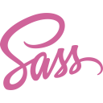
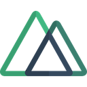
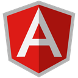
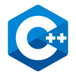
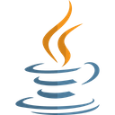
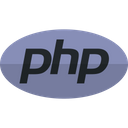
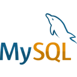

## Hi there 👋

Hi, my name is Manmohan. I was first introduced to web development in 2012 in high school which triggered my interest in coding so I decided to pursue Computer Science Engineering.

During my graduation, along with learning different languages, I enjoyed managing events during college fests and other miscellaneous occasions.
  
Entered the industry in 2017 and was amazed to see how things actually worked in real life coupled with each other.
  
Started the first job working as full stack web developer where I got the chance to work with a lot of technologies including jQuery, Angular, PHP, Python, MySQL, MongoDB.
  
After a while I realised my interest leaning more towards frontend development.
  
Fast forward to 2020, just before the Covid era, switched to a new organisation as a UI Developer. And here we are now, an enthusiastic UI developer who loves to explore new frameworks and emerging technologies.
  

### Things that helped me grow

* the eagerness to learn new stuff
* critical eye for user experience and interface.

### Interests

* recently discovered love for travelling and meeting new people
* definitely love for music.

### Technologies worked on

  
  
  
  
   
  
  
  
  
  
  
   
  
  
  
  
  
   
  
  

<!-- ### Let's connect -->

<!--
**Manmohan7/manmohan7** is a ✨ _special_ ✨ repository because its `README.md` (this file) appears on your GitHub profile.

Here are some ideas to get you started:

- 🔭 I’m currently working on ...
- 🌱 I’m currently learning ...
- 👯 I’m looking to collaborate on ...
- 🤔 I’m looking for help with ...
- 💬 Ask me about ...
- 📫 How to reach me: ...
- 😄 Pronouns: ...
- ⚡ Fun fact: ...
-->

